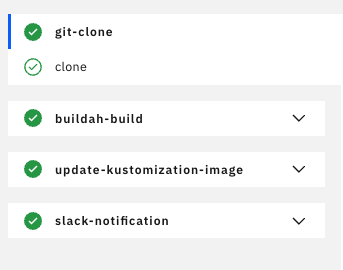

# build-pipeline-with-slack

해당 pipeline은 GitOps의 CI 절차에 맞게 이미지를 빌드하고, 배포 코드가 포함된 Config 레포지토리에 빌드한 이미지의 해시값을 저장합니다.

1. 컨테이너 이미지 빌드
2. 이미지 레지스트리에 배포
3. Config 레포지토리에 있는 Kustomize.yaml에 이미지 Digest 변경
4. 성공 여부를 Slack으로 알림

### Dependency

| **Task**  | **Version** |              **Tekton Hub URL**              |
| :-------: | :---------: | :------------------------------------------: |
| git-clone |     0.9     | https://hub.tekton.dev/tekton/task/git-clone |
|  buildah  |     0.9     |  https://hub.tekton.dev/tekton/task/buildah  |

### Tasks

|          **Task**          | **Version** |                   **Docs**                   |
| :------------------------: | :---------: | :------------------------------------------: |
|         git-clone          |     0.9     | https://hub.tekton.dev/tekton/task/git-clone |
|          buildah           |     0.9     |  https://hub.tekton.dev/tekton/task/buildah  |
| update-kustomization-image |     0.1     | [docs](./docs/update-kustomization-image.md) |
|   send-to-channel-slack    |     0.1     |   [docs](./docs/send-to-channel-slack.md)    |

### Parametes

#### 애플리케이션 저장소 관련

|           **Key**           |        **Description**         | **Default** |
| :-------------------------: | :----------------------------: | :---------: |
|   APPLICATION_REPOSITORY    |  애플리케이션 Git 저장소 URL   |     ""      |
|    APPLICATION_REVISION     |        Git 브랜치/태그         |    main     |
| APPLICATION_CONTAINER_IMAGE |     빌드할 컨테이너 이미지     |     ""      |
|   APPLICATION_CONTEXT_DIR   | 애플리케이션 컨텍스트 디렉토리 |     "."     |

#### 설정 저장소 관련

|          **Key**          |     **Description**     | **Default** |
| :-----------------------: | :---------------------: | :---------: |
|     CONFIG_REPOSITORY     |   설정 Git 저장소 URL   |     ""      |
|      CONFIG_REVISION      |     Git 브랜치/태그     |    main     |
| CONFIG_KUSTOMIZATION_PATH | Kustomization 파일 경로 |     ""      |

#### Git 사용자 정보

|    **Key**     |  **Description**  | **Default** |
| :------------: | :---------------: | :---------: |
| GIT_USER_NAME  |  Git 사용자 이름  |     ""      |
| GIT_USER_EMAIL | Git 사용자 이메일 |     ""      |

#### Slack 관련

|      **Key**       |    **Description**     |    **Default**     |
| :----------------: | :--------------------: | :----------------: |
| SLACK_TOKEN_SECRET | Slack 토큰 시크릿 이름 | slack-token-secret |
|  SLACK_CHANNEL_ID  |     Slack 채널 ID      |         ""         |
|   SLACK_BOT_NAME   |     Slack 봇 이름      |     Tekton Bot     |

### Usage

PipelineRun을 실행시키기 전에 사용할 플랫폼(github, container registry)에 관한 secret을 가진 service account가 필요합니다.

```yaml
apiVersion: v1
kind: ServiceAccount
metadata:
  name: tekton-trigger-sa
  namespace: ci # Added namespace declaration
secrets:
  - name: harbor-registry-secret
  - name: github-secret
```

위에서 생성한 service account를 활용하여 PipelineRun을 실행합니다.

> [!TIP]
> PipelineRun 실행 목적 뿐만 아니라 eventlistener를 활용하여 자동으로 Pipeline를 실행해야 할 경우 secret이 포함된 service account가 필요합니다.

```yaml
apiVersion: tekton.dev/v1beta1
kind: PipelineRun
metadata:
  name: build-pipeline-with-slack-run
spec:
  pipelineRef:
    name: build-pipeline-with-slack-pipeline
  serviceAccountName: tekton-trigger-sa
  params:
    # 애플리케이션 저장소 관련 파라미터
    - name: APPLICATION_REPOSITORY
      value: "https://github.com/your-org/your-app.git"
    - name: APPLICATION_REVISION
      value: "main"
    - name: APPLICATION_CONTAINER_IMAGE
      value: "quay.io/your-org/your-app:latest"
    - name: APPLICATION_CONTEXT_DIR
      value: "."

    # 설정 저장소 관련 파라미터
    - name: CONFIG_REPOSITORY
      value: "https://github.com/your-org/your-config.git"
    - name: CONFIG_REVISION
      value: "main"
    - name: CONFIG_KUSTOMIZATION_PATH
      value: "k8s/overlays/production"

    # Git 사용자 정보
    - name: GIT_USER_NAME
      value: "your git user name"
    - name: GIT_USER_EMAIL
      value: "your git user email"

    # Slack 관련 파라미터
    - name: SLACK_TOKEN_SECRET
      value: "slack-token-secret"
    - name: SLACK_CHANNEL_ID
      value: "#deployments"
    - name: SLACK_BOT_NAME
      value: "Tekton Bot"

  workspaces:
    - name: shared
      volumeClaimTemplate:
        spec:
          accessModes:
            - ReadWriteOnce
          storageClassName: nfs-client
          resources:
            requests:
              storage: 100Mi
```

실행 결과

