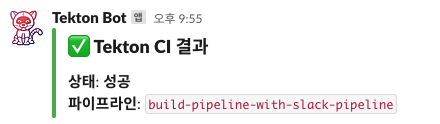
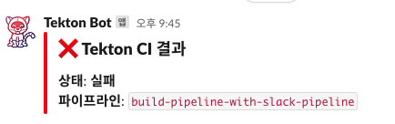

## send-to-channel-slack

PipelineRun의 결과에 맞춰서 Slack 앱에 알림을 보내는 Task입니다.

#### Parameters

|      **Key**       |    **Default**     |                             **Description**                             |
| :----------------: | :----------------: | :---------------------------------------------------------------------: |
| SLACK_TOKEN_SECRET | slack-token-secret |                     slack에서 발급해주는 bot token                      |
|  SLACK_CHANNEL_ID  |         ""         |                         전송할 slack channel id                         |
|   SLACK_BOT_NAME   |     Tekton Bot     |                        Slack에서 생성한 bot 이름                        |
|    TASKS_STATUS    |         x          |    Task 실행 결과. **주로 Pipline 파라미터를 통해 인자를 받습니다.**    |
|   PIPELINE_NAME    |         x          | 실행한 Pipeline 이름. **주로 Pipline 파라미터를 통해 인자를 받습니다.** |

#### Usage

Slack를 사용하기 위해서는 slack bot token이 포함된 secret 리소스가 필요합니다.

```yaml
apiVersion: v1
kind: Secret
metadata:
  name: slack-token-secret
type: Opaque
data:
  token: <slack bot token>
```

```yaml
apiVersion: tekton.dev/v1beta1
kind: TaskRun
metadata:
  name: send-to-channel-slack-run
spec:
  taskRef:
    name: send-to-channel-slack
  params:
    - name: SLACK_TOKEN_SECRET
      value: "slack-token-secret"
    - name: SLACK_CHANNEL_ID
      value: "<channel-id>"
    - name: SLACK_BOT_NAME
      value: "Tekton Bot"
    - name: TASKS_STATUS
      value: "Succeeded"
    - name: PIPELINE_NAME
      value: "build-pipeline-with-slack-pipeline"
```

슬랙에서 아래와 같은 메세지를 확인할 수 있습니다.

 
